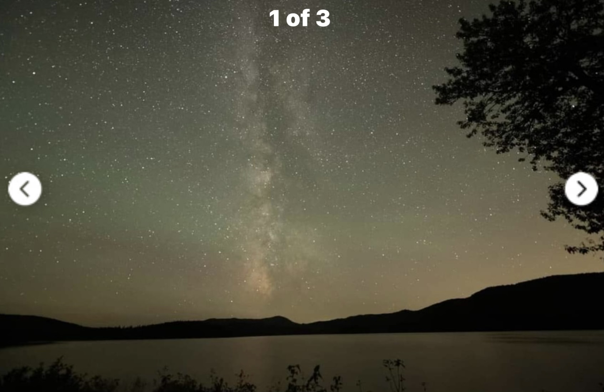

# Creative / DSLR Session — Portraits, Silhouettes, Light Painting

Night 3's main event. Also the first thing folded into a shortened trip, because it shares the
core's window and can't happen without it.

**Hard constraint: the core is up from 9:54 to 11:17 PM (Night 2) and nothing else.** Everything here
happens inside that ninety minutes, and it competes directly with the tracked sky panels. Budget
**the last 20–25 minutes** — get the stacking frames first, then switch to people.

---

## The geometry problem, and the fix

The core tops out at **15° altitude** and sinks to 10° by 11:25. That's low. Low enough that a
standing person, shot from a normal tripod, sits almost entirely *below* it — which is fine for
a figure-under-the-Milky-Way shot but wrong if you want the core right behind someone's head.

The variable that fixes it is **camera height, not distance.**

A person 1.8 m tall, camera at height *c*, head appears at `atan((1.8 − c) / distance)`:

### Distance needed to put a head at core level (15°)

| Camera height | Subject distance |
|---|---|
| 1.4 m (normal tripod) | **1.5 m** — uselessly close |
| 1.0 m | 3.0 m |
| 0.5 m | **4.9 m** ← the sweet spot |
| 0.2 m (on the ground) | 6.0 m |

### Same, for the core at 10° (11:21 / 11:17 / 11:13 PM, nights 1 / 2 / 3)

| Camera height | Subject distance |
|---|---|
| 0.5 m | 7.4 m |
| 0.2 m | 9.1 m |

> **Drop the tripod low — around knee height — and put the subject 5 to 7 metres out.** That's
> the whole trick. From a standing tripod the core will always float uselessly above everyone's
> heads.

Shoot **portrait**: 45° wide × 63.5° tall at 18 mm. Aim the frame centre around **18° altitude**
and you get horizon in the bottom fifth, the core just above it, and band running up the frame.

---

## Settings

**You cannot track this.** A tracked frame smears the subject. Two ways:

**Single frame (simple, do this first)**
- 18 mm, **f/1.8**, **10 s**, **ISO 3200**, untracked
- NPF caps you at 10 s and the subject has to hold still for all of it

**Blend (better, if you have the window)**
- Tracked sky panel: f/2.5, 60–120 s, ISO 800, stacked
- Untracked subject frame: 10 s, f/1.8, ISO 3200
- Composite in post

### Light painting

**A pulse, not a hold.** One to two seconds of warm light during a 10-second exposure, from
off-axis. Illuminating for the full frame blows the subject out and destroys the silhouette.

- Warm white — a headlamp on low, or a phone with an **orange/amber gel**
- Red light preserves everyone's night vision but photographs as flat red; use warm white for
  actual illumination and keep it brief
- Start with **1 s at 3–5 m** and adjust from there. Test on the first frame, don't guess through
  the whole session.
- Light from the **side**, never from the camera position — front light is flat and ugly

### Holding still

Ten seconds is a long time. Have the subject **brace against something or sit**. Breathing is
fine, swaying isn't. And **shoot fifteen to twenty frames** — the failure rate on 10-second
portraits is high and it costs nothing to take more.

---

## Shot list

Ordered by how likely they are to work.

1. **Two silhouettes, core behind** — you've made this picture before, with the moon, in Nov 2023
   (`images/nov2023_moon_silhouette_STRIPPED.jpg`). Same composition, Milky Way instead.
2. **Single figure looking up at the band** — camera low, subject 5–6 m, facing away.
3. **Light-painted foreground** — the shoreline, a rock, the tree at the edge. One pulse of warm
   light, core above. No people needed, high hit rate.
4. **Headlamp beam into the sky** — the beam itself renders in a 10-second exposure. Cheesy and
   it works every time.
5. **Reflection** — figure plus core plus both mirrored in still water. Needs a dead-calm night;
   check before committing.
6. **Lantern at the feet** — warm pool of light at the base of the frame, band above. Softer than
   a flashlight pulse and easier to balance.
7. **Star trails with a figure** — long shot, needs many stacked frames and someone who can hold
   a pose across all of them. Only if everything else is done.

---

## Free bonus

Every one of these is a 10-second untracked exposure pointed at the southwest during
**Earth-grazer hours**. When the radiant is low, meteors enter at a shallow angle and skim
enormous distances across the sky — slow, long, often coloured, and appearing far from Perseus.

Low count, but any single one landing in a silhouette frame is the best photo of the trip.
**Keep the shutter cycling even between poses.**

---

---

## Composition reference — someone else's shot of the same lake

`images/REFERENCE_thirdconn_core_web_NOT_MINE.jpeg`

**Not Stephen's photo.** Found online, screenshotted from a gallery ("1 of 3", nav arrows
visible). No EXIF at all — no date, no bearing, possibly cropped, possibly a different vantage
on the lake. **Composition reference only, not a site survey.** IMG_8460 with its verified
204.4° bearing remains the actual evidence.

What it's useful for:

- **The band is vertical** — matching what Stellarium shows for 11:00–11:30 PM. This is a
  preview of the back half of your window, not the diagonal-band early part.
- **The core sits low and tight to the ridge**, roughly 5–10° above the far shore by eye. That's
  your reality too, and it's what Stellarium's flat mathematical horizon doesn't convey.
- **The far shore profile** is shallow rolling hills with the bigger mass off to one side —
  exactly the low southern fetch the site needs.
- **The green cast is airglow, not light pollution.** A genuine Bortle 1–2 marker. Expect it in
  your own frames; neutralize it in processing or leave it as character.
- **The water is calm enough to mirror.** On a still night a reflection doubles the composition
  and turns a Milky Way photo into a Milky Way *place*. Check the wind before committing.
- **The single tree in the upper corner** is doing real compositional work. Look for the
  equivalent when you scout — one silhouetted branch gives the frame depth that pure
  sky-over-water doesn't.

### What your version should beat

This looks like a single wide frame from a stock body. You have three advantages it doesn't:

| | Theirs | Yours |
|---|---|---|
| **Ha** | Essentially none in the Sagittarius arm | Full-spectrum body with UV/IR cut — M8, M20, and the band's red |
| **Noise** | Single frame, shadows working hard | Tracked, 60–120 s at f/2.5, stacked 20 deep |
| **Foreground** | Crushed to silhouette by necessity | Separate twilight exposure at 8:45, blended |

---

## Practical

- **Bring a second headlamp** — one for lighting the subject, one for seeing what you're doing.
  Tape over the white LED on the second one.
- **Red light for everything except the actual pulse.** You'll be re-framing in the dark.
- **Mark the subject's spot** with a stick or a phone on the ground so poses repeat.
- **Warn the subject it's 10 seconds** before the first frame, not after the first blurred one.
- **Shoot the tracked stacking frames first.** The portraits are the fun part and they will eat
  the whole window if you let them start early.
