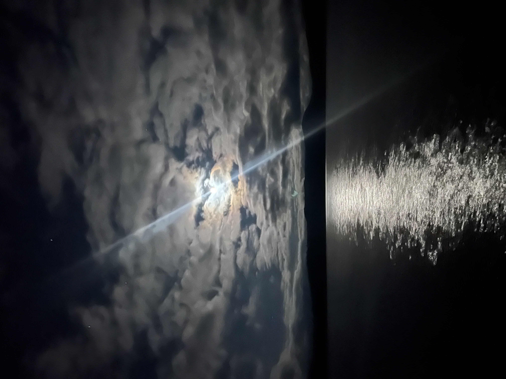
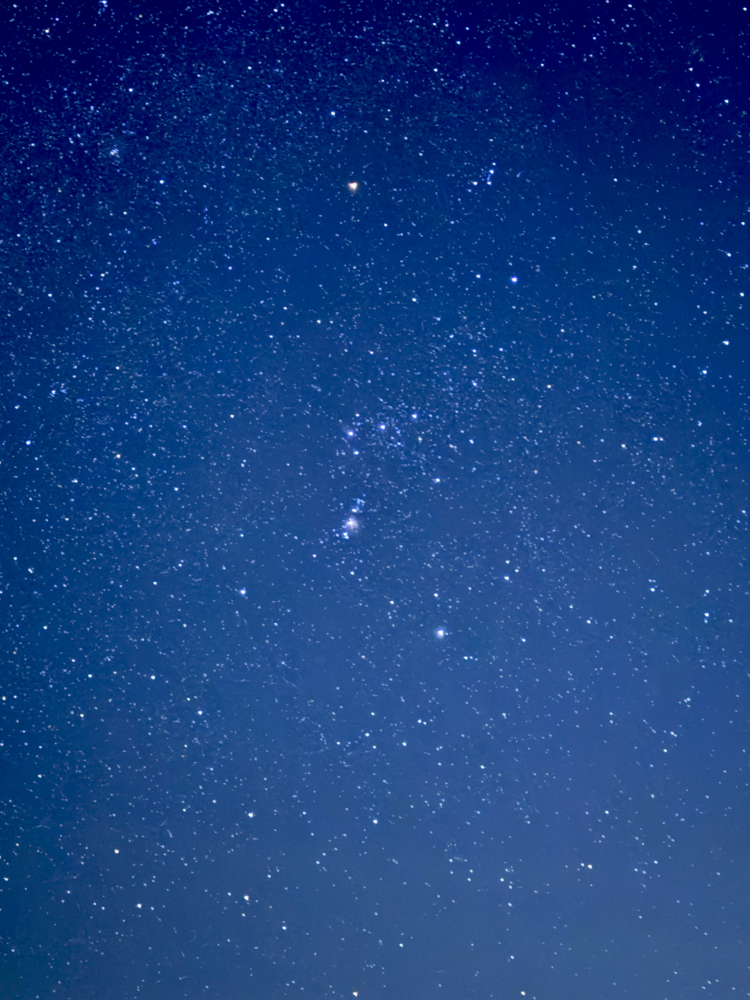
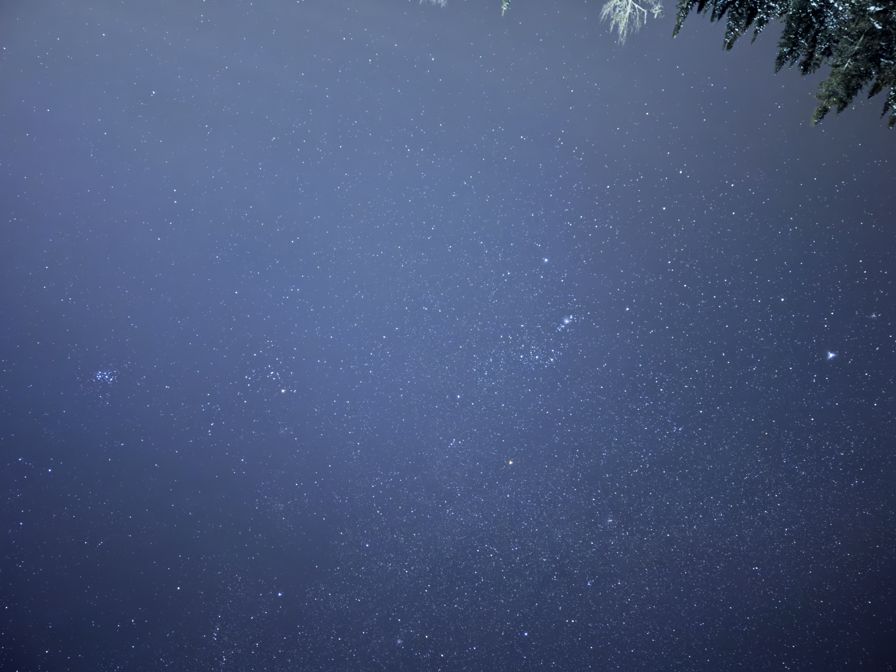
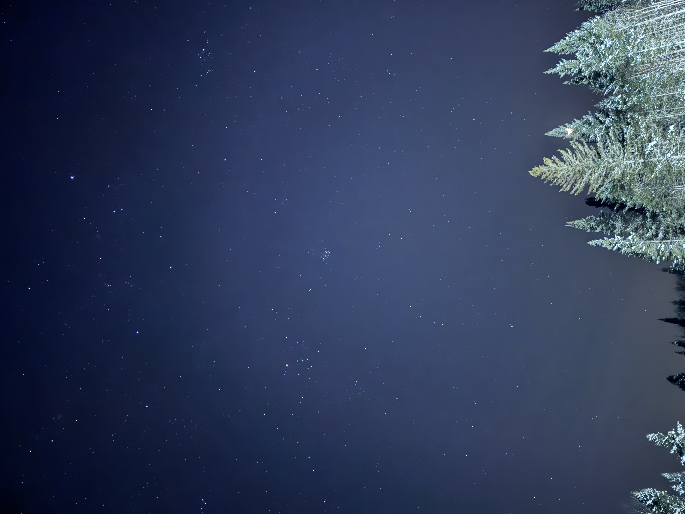
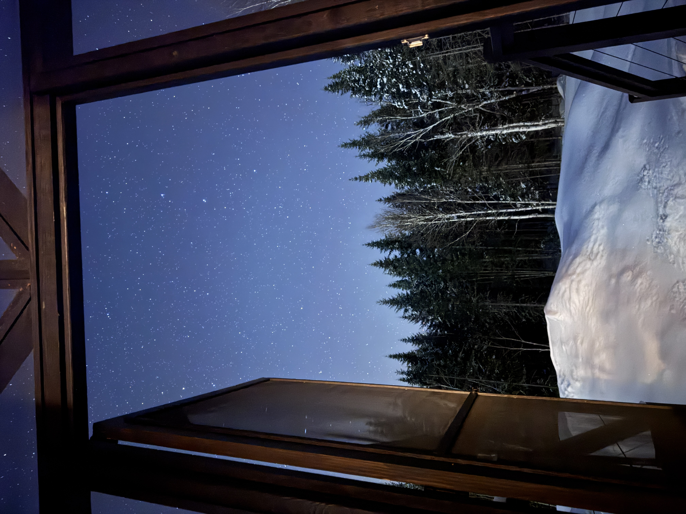
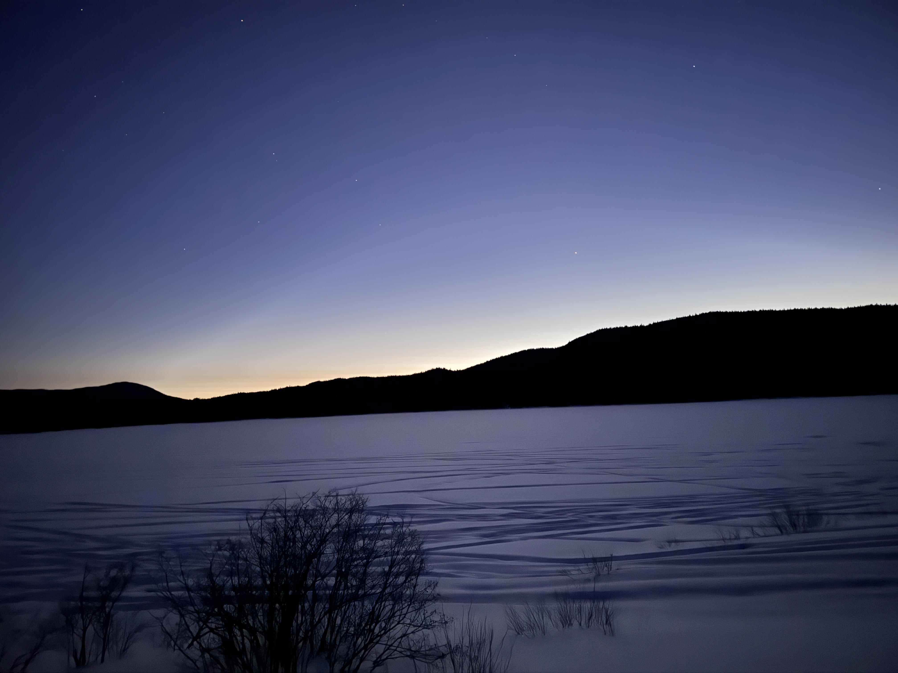
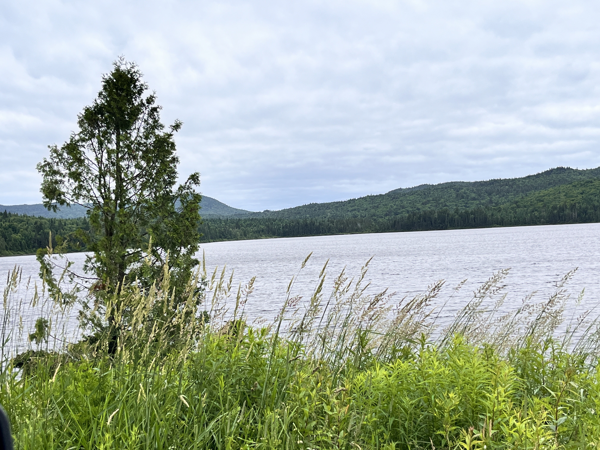

# Horizon Survey from Reference Photos

Everything here was derived from photos Stephen already had. Three were solved by plate
recognition (identifiable constellations + exact timestamp), one by EXIF compass, one by
twilight-glow position, one by Stephen's own recollection of what he'd framed.

Originals are in [`images/`](images/) with EXIF intact — see [images/README.md](images/README.md).

**Method:** iPhone EXIF gives an exact timestamp with UTC offset. Given the location, that
fixes the sky completely — so any recognizable object in frame becomes a calibrated reference
for both azimuth and altitude. Frame scale comes from the EXIF `FOV` field. Orientation comes
from the EXIF `Orientation` tag (Rotate 90 CW / Rotate 180 both appear here and both matter).

---

## Summary — what's now known

| View | Azimuth range | Horizon height | Source |
|---|---|---|---|
| **Lake, SSW** | 177°–232° | **~10°** | [IMG_8460](images/lake_ssw_204deg_IMG_8460.jpeg) — EXIF compass + moon |
| **Cabin, SSW** | 195°–227° | **below 15.5°** | [IMG_6113](images/cabin_ssw_orion_IMG_6113.jpeg) — Orion |
| **Cabin, SW** | 188°–262° | open; ~22° in one corner | [IMG_6117](images/cabin_sw_pleiades_orion_IMG_6117.jpeg) — Pleiades + Orion |
| **Cabin, W** | 232°–290° | **below 5°** centre; **~25°** at WNW edge | [IMG_6116](images/cabin_w_taurus_IMG_6116.jpeg) — Pleiades + Aldebaran |
| **Cabin, NW (doorway)** | centred ~309° | **~17°** | [IMG_6119](images/cabin_nw_doorway_IMG_6119.jpeg) — via M31 framing |
| **Lake, W/WNW** | 225°–298° | **2–4°** SW → **~10°** W | [IMG_6099](images/lake_wnw_twilight_IMG_6099.jpeg) — twilight glow |

> **Bottom line: the cabin's southern and western skies are good. The trees live in the
> northwest and top out around 17°, which clears Dark Shark's 52°–62° with room to spare.**

---

## Lake spot, SSW — SOLVED BY EXIF



`images/lake_ssw_204deg_IMG_8460.jpeg` · iPhone 13 Pro, 2023-11-18 18:15:22 −05:00

**The only file with GPS intact — and it settled the whole site question.**

| Tag | Value |
|---|---|
| **GPSImgDirection** | **204.43° True North** |
| GPS position | 45°14'21.36" N, 71°11'47.16" W (±4.6 m) |
| GPSAltitude | 666.05 m |
| Camera | main camera, 5.7 mm (26 mm equiv), f/1.5 |
| Orientation | Rotate 90 CW → portrait |
| FOV | 69.4° long axis → **69.4° tall × 54.9° wide** |

**Independent cross-check:** the moon's computed position at that exact instant was
**azimuth 203.7°, altitude 16.8°** (topocentric apparent). The phone's compass said 204.4°
and the moon sits just right of frame centre. **Agreement within 0.7°** — compass and
ephemeris validate each other to well under a degree.

> Corrected 4 Aug 2026 — previously 209.1° / 19.5°, a geocentric position that also missed
> in azimuth. Recomputed with astropy.

**Frame covers azimuth 177°–232°**, which contains the entire southern program: Trifid
(186°→216°), core (190°→217°), Rho Oph (208°→220°).

Treeline ≈ **7.3°, provisional** — the old 10° was anchored to the moon fiducial while it
carried a +2.7° error. To measure it properly, scale is
**4032 px / 69.4° = 58.1 px per degree**:

```
treeline altitude = 16.8° − (px from moon centre down to treeline) / 58.1
```

---

## Cabin, SSW — SOLVED BY ORION



`images/cabin_ssw_orion_IMG_6113.jpeg` · iPhone 15 Pro Max, 2026-02-21 20:47:51 EST
**48 mm equiv** (2× crop), FOV 41.1° tall × 31.4° wide, portrait. No GPS.

**Identified:** orange Betelgeuse near the top, the three-star Belt across the middle, the
Orion Nebula as a distinct fuzzy patch below. Unambiguous.

Computed at that timestamp (LST 7h 10m):

| Star | Altitude | Azimuth |
|---|---|---|
| Betelgeuse | 49.0° | 209.0° |
| Belt | 39.2° | 211° |
| Rigel | 30.7° | 214° |

> **Frame centre ≈ altitude 36°, azimuth 211°. Spans azimuth 195°–227°, altitude 15.5°–56.5°.**

**The bottom of that frame is pure sky — no treeline at all.**

> ### The finding that matters
> **At azimuth 195°–227° the cabin horizon is below 15.5°.** That is exactly where the Milky
> Way core sits from ~10:20 PM (az 197°) through past midnight (az 217°), and where M8/M20
> tracks all evening. **The cabin's core-and-Trifid window is clear.**

---

## Cabin, SW — SOLVED BY PLEIADES + ORION



`images/cabin_sw_pleiades_orion_IMG_6117.jpeg` · iPhone 15 Pro Max, 2026-02-21 20:53:12 EST
24 mm equiv, FOV 73.7°, **Orientation: Rotate 180**. No GPS.

Taken 76 seconds after the Taurus frame below — a wide landscape sweep containing **both**
the Pleiades and Orion.

**Verification:** measured separation between the two in-frame = **37.9°**. True separation =
**36.7°**. Match.

Computed at that timestamp (LST 7h 15m):

| Object | Altitude | Azimuth |
|---|---|---|
| Pleiades | 43.3° | 261.3° |
| Orion Belt | 38.7° | 212.5° |

> **Frame centre ≈ altitude 41°, azimuth 225° — southwest. Spans ~188°–262°.**

Trees intrude only in one corner toward the low-azimuth end, topping out around **20–25°**.
Everything else is open. Note this slightly disagrees with the Orion frame above, which showed
clear sky to 15.5° over 195°–227° — the trees are probably confined to a narrow azimuth band
near 188°–200°, or my corner measurement is off. Wide-angle corners suffer projection
distortion; treat ±5°.

---

## Cabin, W — SOLVED BY TAURUS



`images/cabin_w_taurus_IMG_6116.jpeg` · iPhone 15 Pro Max, 2026-02-21 20:51:56 EST
24 mm equiv, FOV 73.7°, Rotate 90 CW → portrait. No GPS.

**Identified:** a tight compact cluster (Pleiades) with an orange star ~12° away (Aldebaran).
True separation 13.7° — matches within tolerance.

| Object | Altitude | Azimuth |
|---|---|---|
| Pleiades (M45) | 43.5° | **261.1°** |
| Aldebaran | 46.4° | 242.1° |

> **Frame centre ≈ altitude 41°, azimuth 261° — due west. Stephen's guess was right.**
> Spans azimuth ~232°–290°, altitude ~4.5°–78°.

Open down to at least 4.5° through the middle (~240°–275°), but conifers climb to about
**25° at the WNW edge, near azimuth 285°.**

Relevant: the Veil finishes its run at azimuth 269° / altitude 47° at 3:45 AM — comfortably
above those trees.

---

## Cabin, NW "doorway" — SOLVED BY STEPHEN'S OWN FRAMING



`images/cabin_nw_doorway_IMG_6119.jpeg` · iPhone 15 Pro Max, 2026-02-21 21:12:15 EST
24 mm equiv, FOV 73.7°, Rotate 90 CW → portrait, Night Mode (30 s + 10 + 10). No GPS.

Shot from inside, past a window/door frame and deck rail, snow-laden conifers along one side.
**No asterism was identifiable at the available resolution** — but Stephen pre-planned this
composition months ahead so that **M31 would sit centred in the doorway**.

M31 at that exact timestamp: **altitude 20.5°, azimuth 308.6°.**

> **The doorway looks northwest, centred about 20° up.** Frame therefore spans roughly
> altitude −16° to +57°, and the conifers come out at **~17°** — considerably better than the
> ~35° estimated before the pitch was known.

Consistent with "north is a little harder," and **Dark Shark never drops below 52.7°, so it
clears easily.** Dark Shark stays in the plan.

### The doorway shot in August

The exact February composition **does not reproduce.** M31 only reaches azimuth 309° at hour
angle +6.9h, which in mid-August lands near 11 AM — daylight.

**The idea works through a different opening.** At **11:00 PM on Aug 12, M31 is at azimuth 65°,
altitude 36° — northeast**, and the Perseid radiant is at azimuth 30°, altitude 28°, about 29°
away. So a **northeast-facing** window, porch post, or roof edge framing 30–45° up gives M31
in the aperture with meteors crossing it.

The NW doorway isn't useless either: at 2 AM it sits **77° from the radiant**, very near the
theoretical maximum for trail length. Fewer meteors, but the longest ones in the sky.

---

## Lake, W/WNW — SOLVED BY TWILIGHT GLOW



`images/lake_wnw_twilight_IMG_6099.jpeg` · iPhone 15 Pro Max, 2026-02-21 18:21:22 EST
24 mm equiv, FOV 73.7°, landscape. No GPS.

Sunset that day was 5:22 PM, so at 6:21 PM the sun sat at **altitude −11.1°, azimuth 266.6°** —
just short of the end of nautical twilight.

> **The glow in this photo is twilight, not light pollution.** An hour after sunset at −11° the
> western sky is *supposed* to look like that. It says nothing about the site's darkness.

Brightest point of the glow puts **frame centre near azimuth 260° (±8°), spanning ~225°–298°.**

**Ridgeline profile**, using the far shoreline of the flat lake as the 0° reference:

| Azimuth | Ridge height |
|---|---|
| ~235° (SW) | **2–3°** |
| ~252° | **3–4°** |
| ~284° (W) | **~9°** |
| ~298° (WNW) | **~10°** |

Beautifully low across the southwest. If this is the same site as IMG_8460, the two together
cover **azimuth 177° through 298°** — the whole western half of the southern sky.

> **Unconfirmed:** no GPS on this file, so it isn't proven to be the 45.239/−71.196 spot.
> Re-shoot from the exact tripod position with location services **on**.

---

## Lake, daylight (June 2024)



`images/lake_daylight_IMG_6182.jpg` · 2024-06-29 12:37:08, `Software: Google` — **GPS and
compass bearing stripped by Google Photos.** Direction unknown; fully overcast so no shadows
and the sun was above the frame, both sun methods dead.

Horizon still measurable using the far shoreline as the 0° line: ridge runs **~2.5° at the left
edge to ~8° at the right**. Foreground grass is tall and close — from a low tripod it would
block several degrees on its own, possibly more than the hills. **Set up at the water's edge or
run the tripod high.**

---

## Stripped files (kept for reference)

- `images/nov2023_moon_silhouette_STRIPPED.jpg` — two figures against moonlit cloud. All EXIF
  gone except `Orientation: Horizontal`. Started as a 4032×3024 iPhone frame.
- `images/nov2023_interior_STRIPPED.jpg` — through a vehicle window, moonlit cloud. Portrait
  (Rotate 90 CW). No date, no GPS.

Both from the same Nov 18, 2023 evening as IMG_8460, which retained everything. **That one file
did more than these two combined.**

---

## Do this in August

The iPhone 15 Pro Max records `GPSImgDirection` when location services are enabled — the
February shots simply had it off.

1. **Turn location services on for the camera** before you leave.
2. From each tripod position, shoot a **level 24 mm landscape frame** at roughly 180°, 210°,
   240°, 270°, and 000°, with the horizon visible.
3. Send **originals** — AirDrop, or Share → Options → "All Photos Data". Google Photos and
   messaging apps strip both GPS and compass bearing.

With bearing plus a visible horizon I can compute ridge altitude at every azimuth and build a
proper Stellarium landscape file for the site — replacing the flat mathematical horizon that's
currently lying to you about exactly the low southern targets that matter.
